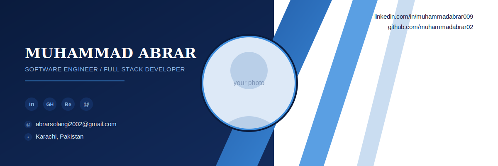

<h1 align="center">
Hey there! 
</h1>

<h1 align="center">I'm Muhammad Abrar</h1>

<h3 align="center">
Software Engineer • Full Stack Developer • React.js & Next.js • API Integration
</h3>

Building scalable, user-focused web applications — from responsive frontends to robust backend systems.

  

---

## 👋 About Me

I'm a **Full Stack Developer** with a Bachelor's degree in Software Engineering and hands-on experience building scalable web applications using **React.js, Next.js, Node.js, Express.js, and MongoDB**.

I focus on developing responsive, intuitive frontend interfaces while also being comfortable handling backend development and API integration.

I've worked directly with clients and cross-functional teams to translate business requirements into user-friendly, production-ready software — and I'm always looking for ways to optimize performance and improve product quality.

---

## 🚀 What I'm Currently Working On

- 💼 Contributing full stack development on a client-focused business application
- 🤖 Assisting in the integration of AI-powered features into web portal applications
- 🧩 Building and maintaining reusable, scalable frontend components
- 🔌 Handling API integration and database operations for real-world business needs
- 🐛 Participating in code reviews, debugging, and continuous improvement initiatives

---

## 🧠 Areas of Interest

- Full Stack Web Development
- Frontend Architecture (React / Next.js)
- API Design & Integration
- UI/UX for Web Applications
- Automation (n8n)
- Software Development Lifecycle (SDLC)
- Project Management
- Prompt Engineering & AI Tooling

---

## 🛠️ Tech Stack

### Frontend

### Backend & Databases

`SQL` &nbsp;·&nbsp; `MySQL` &nbsp;·&nbsp; `Supabase` &nbsp;·&nbsp; `SQLite` &nbsp;·&nbsp; `PostgreSQL`

### AI Tools

- ChatGPT
- Prompt Engineering
- n8n (AI Automation)

### Testing & Workflow

`SDLC` &nbsp;·&nbsp; `Project Management` &nbsp;·&nbsp; `Strapi` &nbsp;·&nbsp; `Sanity` &nbsp;·&nbsp; `shadcn/ui`

---

## 🌱 Currently Learning

- Advanced Backend Architecture & Databases
- AI Automation with n8n
- Design Systems & Scalable Frontend Patterns
- React Native

---

## 🎓 Education

**BS Software Engineering** (2026)
Sindh Madressatul Islam University (SMIU), Karachi, Pakistan

---

## 📫 Let's Connect

---

## ⚡ GitHub Stats

---

## 🏆 GitHub Trophies

---

## 💬 Philosophy

> **Good code works. Great products solve real problems for real people.**
>
> I enjoy building software where clean architecture, thoughtful UX, and business goals come together.

---
